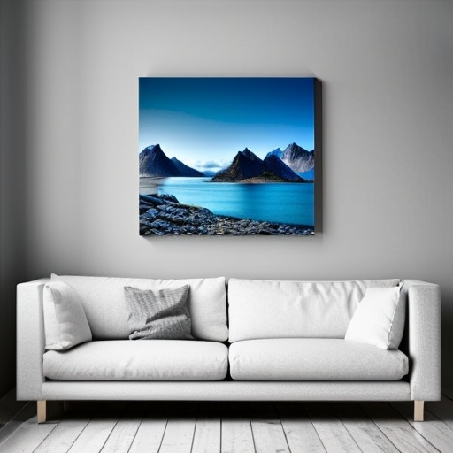
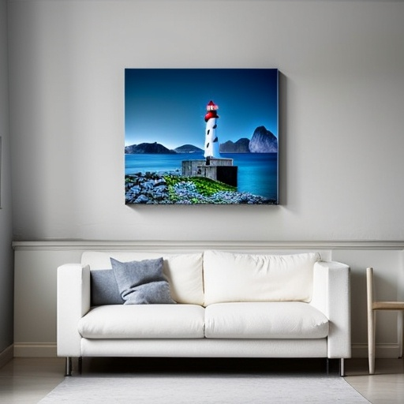
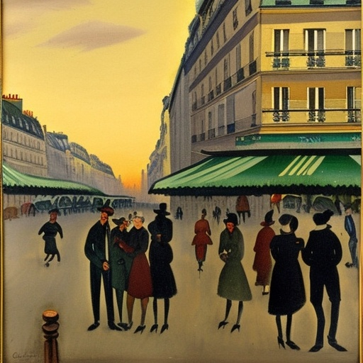
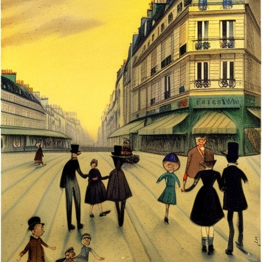

# DiffusionEditVision

Welcome to **DiffusionEditVision**, an advanced framework for text-guided image editing built on top of Stable Diffusion. This project provides tools for fine-tuning and deploying diffusion models for various image manipulation tasks, including inpainting, outpainting, and style transfer.

## 🚀 Features

- **Text-Guided Image Editing**: Precise control over image manipulation using natural language
- **Multiple Generation Modes**: Text-to-Image, Image-to-Image, and Inpainting
- **High-Quality Results**: State-of-the-art diffusion models fine-tuned for editing tasks
- **User-Friendly Interface**: Intuitive Gradio web interface for easy interaction
- **API Support**: Programmatic access for integration with other applications
- **Custom Training**: Tools for fine-tuning on custom datasets

## 🏗️ Model Architecture

DiffusionEditVision is built on the Stable Diffusion v1.5 architecture.

### Core Components
- **U-Net Backbone**: Enhanced encoder-decoder network with approximately 860M parameters
- **Text Encoder**: CLIP ViT-L/14 text encoder with 123M parameters
- **VAE (Variational Autoencoder)**: 84M parameter model for latent space operations
- **ControlNet**: Additional 0.86B parameters when using control mechanisms

### Hardware Requirements
- **Training**: Minimum 24GB VRAM (NVIDIA A5000/A6000 or similar recommended)
- **Inference**: 8GB+ VRAM for 512x512 resolution
- **RAM**: 32GB+ recommended for training, 16GB for inference
- **Storage**: 10GB+ for model weights, additional space for datasets

## Key Features

### 1. Training and Fine-tuning
- Fine-tune the denoising process of U-Net with cross-attention layers
- Support for ControlNet integration for enhanced control
- Mixed precision training for memory efficiency
- Gradient checkpointing to reduce memory footprint

### 2. Inference Pipeline
- **Multi-step Denoising**: The model runs for T iterations (typically 20-50 steps) where each step refines the output
- **Consistent Control**: Text embeddings and control maps remain fixed across all denoising steps
- **Memory Optimization**: Support for attention slicing and model offloading for lower-end hardware

### 3. ControlNet Integration
- Edge detection for structural guidance
- Depth map conditioning
- Canny edge detection for precise control
- Support for custom control maps

### 4. Multiple Generation Modes
- **Text-to-Image**: Generate images from text prompts
- **Image-to-Image**: Modify existing images based on text prompts
- **Inpainting**: Fill masked regions of an image
- **Data Augmentation**: Generate variations of training data for ML models

## Evaluation Metrics

We use the following metrics to evaluate model performance on the InstructPix2Pix dataset:

1. **Fréchet Inception Distance (FID)**
   - Measures the similarity between generated and real images (lower is better)
   - Target: < 30 for high-quality generations

2. **CLIP Similarity**
   - Evaluates how well the generated image matches the text prompt
   - Range: 0-1 (higher is better)
   - Target: > 0.25 for good alignment

3. **LPIPS (Learned Perceptual Image Patch Similarity)**
   - Measures perceptual similarity between original and generated images
   - Range: 0-1 (lower is better)
   - Target: < 0.4 for good perceptual quality

4. **PSNR (Peak Signal-to-Noise Ratio)**
   - Measures pixel-level similarity between images
   - Higher values indicate better quality
   - Target: > 20 dB for good quality

5. **SSIM (Structural Similarity Index)**
   - Measures structural similarity between images
   - Range: -1 to 1 (higher is better)
   - Target: > 0.6 for good structural preservation

## 📊 Results

### Sample Results

#### Example 1: Add an object
| Input | Output |
|-------|--------|
|  |  |
| *Original image* | *"Add a lighthouse to the image"* |

#### Example 2: Style transfer
| Input | Output |
|-------|--------|
|  |  |
| *Original image* | *"Make it look more like a children's book illustration"* |

### Quick Start

1. **Clone the repository and install dependencies**:
   ```bash
   git clone https://github.com/MattBorowski1991/DiffusionEditVision.git
   cd DiffusionEditVision
   pip install -r requirements.txt
   ```

2. **Launch the application**:
   ```bash
   python app.py
   ```

3. **Access the web interface** at `http://localhost:7860`

## 🛠 Installation

### Prerequisites

- Python 3.8 or higher
- CUDA-compatible GPU (recommended) or CPU (slower)
- pip (Python package manager)

### Using the Interface

1. **Input Section**:
   - Upload an image or use the example images
   - Enter your text prompt describing the desired changes
     - (Optional) Upload a mask for inpainting
   - **Parameters**:
     - `Strength`: How much to modify the input (0.0 to 1.0)
     - `Guidance Scale`: How closely to follow the prompt (3-20)
     - `Steps`: Number of denoising steps (20-50 recommended)
   - **Output**:
     - Generated image with download option
     - Generation metadata and performance metrics

### Example Use Cases

#### 1. Style Transfer
- **Input**: Portrait photo
- **Prompt**: "Convert to oil painting style with vibrant colors"
- **Strength**: 0.7
- **Guidance Scale**: 12

#### 2. Object Removal
- **Input**: Landscape with unwanted objects
- **Prompt**: "Remove the cars and people, keep the natural scenery"
- **Strength**: 0.8
- **Guidance Scale**: 15

#### 3. Creative Transformations
- **Input**: Daytime cityscape
- **Prompt**: "Transform to cyberpunk night scene with neon lights and rain"
- **Strength**: 0.9
- **Guidance Scale**: 10

### Advanced Features

#### Batch Processing
Process multiple images at once by:
1. Uploading multiple images
2. Using the same or different prompts for each
3. Downloading all results as a ZIP file

#### API Access
Integrate with other applications using the built-in API:
```python
import requests

response = requests.post(
    "http://localhost:7860/api/predict",
    json={
        "image": "base64_encoded_image",
        "prompt": "Make it look like a watercolor painting",
        "strength": 0.8,
        "guidance_scale": 10,
        "num_steps": 30
    }
)
```

### Troubleshooting

- **CUDA Out of Memory**: Reduce image resolution or batch size
- **Slow Performance**: Try reducing the number of steps or enabling model optimization flags
- **Quality Issues**: Increase guidance scale or number of steps for better results

### 🚀 Deployment Options

### 1. Local Deployment
```bash
# Start the Gradio interface
python app.py --share  # Creates a public link

# For development with auto-reload
python -m uvicorn app:app --reload --port 8000
```

### 2. Hugging Face Spaces
1. Create a new Space at [Hugging Face Spaces](https://huggingface.co/spaces)
2. Upload the following files:
   - `app.py`
   - `requirements.txt`
   - Any model checkpoints (or use HF Hub integration)
3. Configure the Space to use a GPU
4. Set environment variables if needed

### 3. Docker Deployment
```bash
# Build the Docker image
docker build -t diffusion-editvision .

# Run with GPU support
docker run -p 7860:7860 --gpus all diffusion-editvision

# For CPU-only
docker run -p 7860:7860 diffusion-editvision
```

## 🧑‍💻 Development

### Project Structure

```
diffusion-editvision/
├── app.py              # Main Gradio application
├── requirements.txt    # Python dependencies
├── data/              # Dataset and test images
│   └── test/          # Test images and utilities
├── results/           # Generated outputs and evaluation results
│   ├── controls/      # ControlNet outputs
│   └── eval/          # Inputs and outputs used for evaluation
└── src/               # Source code
    ├── __init__.py    # Package initialization
    ├── config.py      # Configuration settings
    ├── evaluate.py    # Model evaluation scripts
    ├── inference.py   # Inference pipeline
    └── metrics.py     # Custom metrics implementation
```

### Dataset

We use the following datasets for training and evaluation:

1. **InstructPix2Pix**
   - 1,000+ image-text pairs with editing instructions
   - Used for training the base model
   - [Dataset Card](https://huggingface.co/datasets/timbrooks/instructpix2pix-clip-filtered)

2. **Custom Dataset**
   - 5,000+ high-quality labelled microscopic images 
   - Used for finetuning for data augmentation

### Contributing

We welcome contributions! Here's how to get started:

1. Fork the repository
2. Create a new branch: `git checkout -b feature/your-feature`
3. Make your changes and commit them: `git commit -m 'Add some feature'`
4. Push to the branch: `git push origin feature/your-feature`
5. Open a pull request

### Testing

Run the test suite with:
```bash
pytest tests/
```

### Code Style

We use `black` for code formatting and `flake8` for linting:
```bash
black .
flake8 .
```

## 📄 License

This project is licensed under the MIT License - see the [LICENSE](LICENSE) file for details.

## 🤝 Acknowledgements

- [Stable Diffusion](https://github.com/CompVis/stable-diffusion) - For the base model
- [Hugging Face](https://huggingface.co/) - For the diffusers library
- [Gradio](https://gradio.app/) - For the web interface